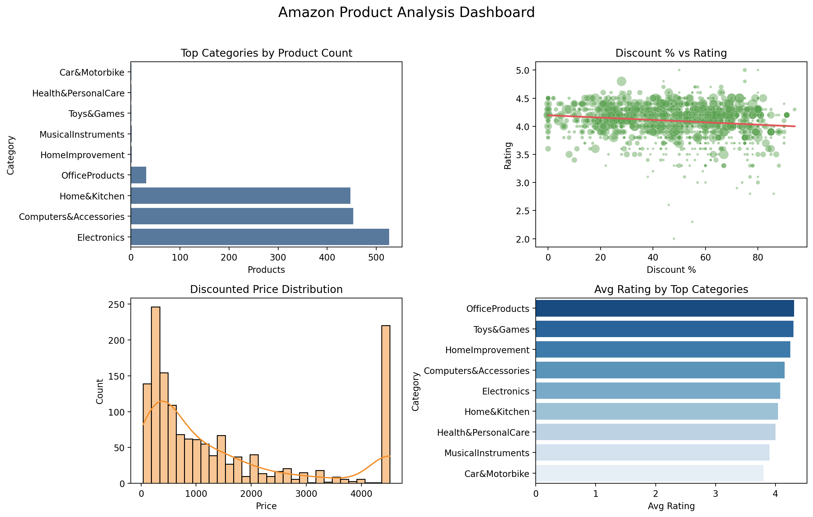
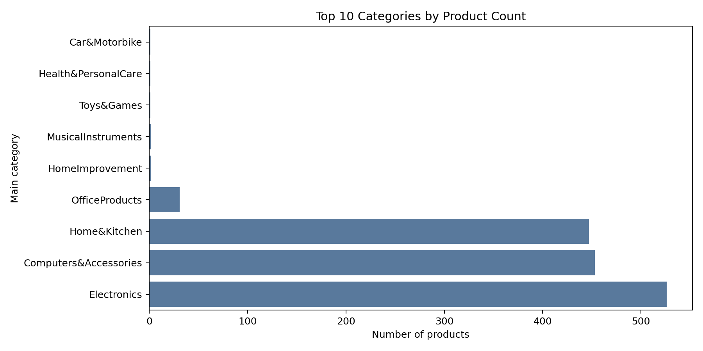
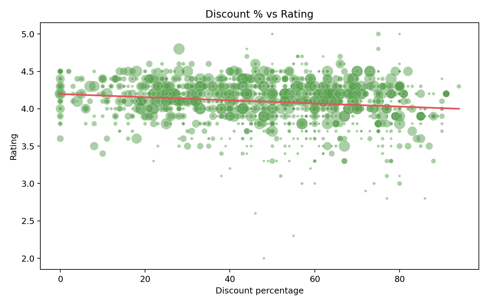
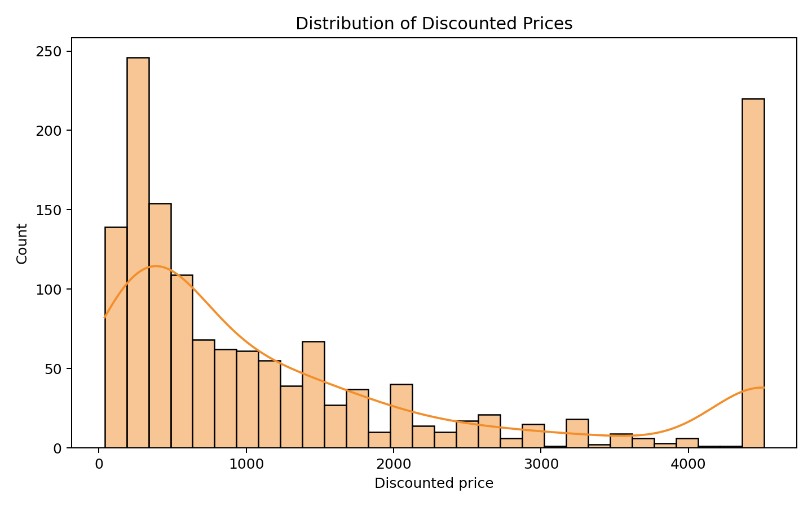

# Amazon Product Data Analysis

End-to-end exploratory and descriptive analytics project on Amazon product listings, focused on pricing, discount strategy, customer ratings, and category-level performance.

## Project Objective

This project analyzes Amazon marketplace product data to answer practical business questions:

- Which categories dominate catalog share?
- How strong is the relationship between discounting and customer ratings?
- What does the product price distribution look like?
- Where can pricing and merchandising decisions be improved?

## Dataset Overview

- **Records:** 1,464 products
- **Features:** 19 transformed columns
- **Main domains:** `Electronics`, `Computers&Accessories`, `Home&Kitchen`, and smaller categories
- **Core metrics used:** `discounted_price`, `actual_price`, `discount_percentage`, `rating`, `rating_count`, `main_category`

Source files are stored in `data/`:
- `amazon.csv` (raw)
- `amazon_cleaned.csv` (cleaned)
- `amazon_transformed.csv` (analysis-ready)

## Analysis Workflow

The project is organized as a notebook pipeline:

1. `notebooks/01_data_exploration.ipynb` - schema understanding, missing values, basic profiling
2. `notebooks/02_data_cleaing.ipynb` - cleaning, type conversion, feature preparation
3. `notebooks/03_eda_visualization.ipynb` - visual EDA and business-oriented insights

## Key Business Insights

- Catalog concentration is high: `Electronics`, `Computers&Accessories`, and `Home&Kitchen` account for most products.
- Average discount is substantial (**47.71%**), suggesting frequent price-based promotion.
- Average rating remains strong (**4.10/5**), but discount depth has a **slight negative correlation** with rating (**-0.155**), so deeper discounting does not guarantee better customer perception.
- Median discounted price is **799**, indicating most products are positioned in lower-to-mid price bands.
- `OfficeProducts` shows a high average rating but low sample size; decisions should consider category volume before prioritization.

## KPI Snapshot

- **Total products analyzed:** 1,464
- **Number of main categories:** 9
- **Average rating:** 4.10
- **Average discount percentage:** 47.71%
- **Median discounted price:** 799
- **Correlation (discount vs rating):** -0.155

## Executive Dashboard

The dashboard combines four decision-critical views:

- Category concentration (product count)
- Discount impact on ratings (with trend line)
- Discounted price distribution
- Category-level average rating comparison



## Important Figures

### 1) Top Categories by Product Count


### 2) Discount Percentage vs Rating


### 3) Discounted Price Distribution


## Strategic Recommendations

- Use **targeted discounting** instead of broad deep discounts; optimize for conversion while preserving rating quality.
- Build **category-specific pricing strategies** because category behavior is not uniform.
- Prioritize inventory and campaigns in high-volume categories, then test premium or low-volume segments separately.
- Track rating and review dynamics over time (time-series extension) to separate short-term promo effects from long-term product quality signals.

## Project Structure

```text
Amazon data analysis/
|-- data/
|   |-- amazon.csv
|   |-- amazon_cleaned.csv
|   |-- amazon_transformed.csv
|-- notebooks/
|   |-- 01_data_exploration.ipynb
|   |-- 02_data_cleaing.ipynb
|   |-- 03_eda_visualization.ipynb
|-- Figures/
|   |-- amazon_dashboard.png
|   |-- top_categories_by_products.png
|   |-- discount_vs_rating.png
|   |-- discounted_price_distribution.png
|-- requirements.txt
|-- README.md
```

## Setup and Run

```bash
pip install -r requirements.txt
```

Then run notebooks in order from `notebooks/`.

## Tools Used

- Python
- Pandas, NumPy
- Matplotlib, Seaborn
- Jupyter Notebook

## Limitations and Next Steps

- `rating_count` appears preprocessed/scaled in the transformed file; confirm original semantics before advanced forecasting.
- Add time dimension (if available) for trend and seasonality analysis.
- Extend with predictive modeling (price banding, rating prediction, conversion proxy modeling).
